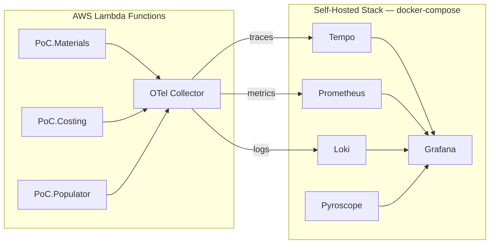
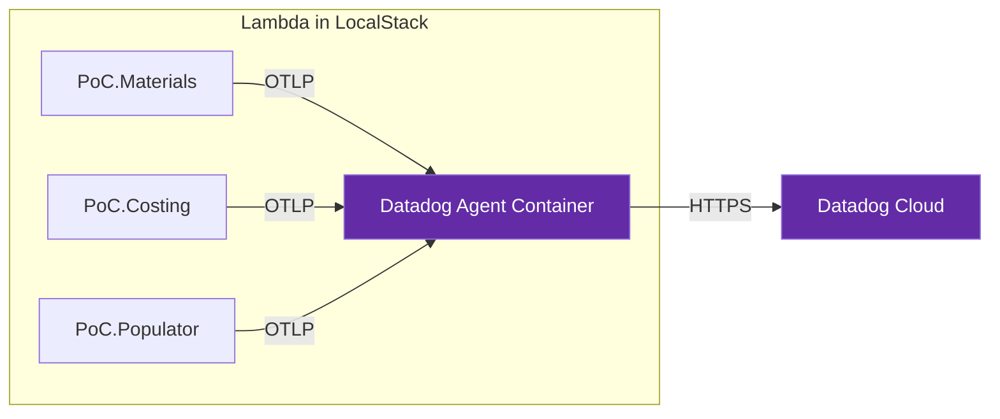
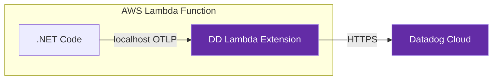

# Datadog Migration Analysis — What to Keep, What to Remove

## Executive Summary

The **good news**: your application code is already vendor-agnostic. `PoC.Observability` exports telemetry via **OTLP** (OpenTelemetry Protocol), which Datadog natively ingests. The migration is almost entirely an **infrastructure swap**. Since your workloads run exclusively on **AWS Lambda**, you do **NOT** need ECS — Datadog provides a **Lambda Extension** (a Lambda Layer) that runs as a sidecar inside each function and forwards telemetry to Datadog Cloud.

---

## Current Observability Stack Inventory

````carousel
### Current Architecture

<!-- slide -->
### Target — Local Dev (docker-compose)

<!-- slide -->
### Target — AWS Production

````

### Docker-Compose Containers (Current)

| Container | Purpose | Datadog Equivalent | Action |
|-----------|---------|-------------------|--------|
| `otel-collector` | OTLP gateway → routes to backends | **Datadog Agent** (native OTLP intake on ports 4317/4318) | 🔴 **REMOVE** |
| `tempo` | Distributed tracing backend | **Datadog APM** (Trace Explorer) | 🔴 **REMOVE** |
| `prometheus` | Metrics backend (scrape model) | **Datadog Metrics** (push model via OTLP) | 🔴 **REMOVE** |
| `loki` | Log aggregation backend | **Datadog Log Management** | 🔴 **REMOVE** |
| `grafana` | Visualization UI | **Datadog Dashboards** | 🔴 **REMOVE** |
| `pyroscope` | Continuous profiling | **Datadog Continuous Profiler** | 🔴 **REMOVE** |
| `localstack` | AWS emulation | N/A (unrelated) | ✅ **KEEP** |
| `postgres` | Unleash DB | N/A (unrelated) | ✅ **KEEP** |
| `unleash` | Feature flags | N/A (unrelated) | ✅ **KEEP** |
| `unleash-init` | Flag bootstrapping | N/A (unrelated) | ✅ **KEEP** |

### Docker Volumes to Remove

| Volume | Tied To |
|--------|---------|
| `tempo-data` | Tempo |
| `prometheus-data` | Prometheus |
| `loki-data` | Loki |
| `grafana-data` | Grafana |

### Config Files to Remove

| File/Directory | Purpose |
|----------------|---------|
| [otel-collector-config.yaml](file:///d:/Projetos/poc_feature/docker/observability/otel-collector-config.yaml) | OTel Collector pipelines (traces→Tempo, metrics→Prometheus, logs→Loki) |
| [tempo.yaml](file:///d:/Projetos/poc_feature/docker/observability/tempo.yaml) | Tempo storage and ingestion config |
| [prometheus.yaml](file:///d:/Projetos/poc_feature/docker/observability/prometheus.yaml) | Prometheus scrape targets |
| [loki.yaml](file:///d:/Projetos/poc_feature/docker/observability/loki.yaml) | Loki storage and schema config |
| [provisioning/datasources/](file:///d:/Projetos/poc_feature/docker/observability/provisioning/datasources/datasources.yaml) | Grafana datasource auto-provisioning |
| [provisioning/dashboards/](file:///d:/Projetos/poc_feature/docker/observability/provisioning/dashboards) | Grafana dashboard provisioning |
| [dashboards/*.json](file:///d:/Projetos/poc_feature/docker/observability/dashboards) | 9 Grafana dashboard JSON files |

---

## What Needs to Change

### 1. Docker-Compose — Replace 6 Containers with 1

Add the **Datadog Agent** container. It natively accepts OTLP on ports `4317` (gRPC) and `4318` (HTTP):

```yaml
  datadog-agent:
    image: gcr.io/datadoghq/agent:7-jmx
    container_name: datadog-agent
    environment:
      - DD_API_KEY=${DD_API_KEY}
      - DD_SITE=${DD_SITE:-datadoghq.com}
      # Enable OTLP ingestion (replaces OTel Collector entirely)
      - DD_OTLP_CONFIG_RECEIVER_PROTOCOLS_GRPC_ENDPOINT=0.0.0.0:4317
      - DD_OTLP_CONFIG_RECEIVER_PROTOCOLS_HTTP_ENDPOINT=0.0.0.0:4318
      # Enable APM (traces)
      - DD_APM_ENABLED=true
      - DD_APM_NON_LOCAL_TRAFFIC=true
      # Enable Logs
      - DD_LOGS_ENABLED=true
      # Enable Continuous Profiler (replaces Pyroscope)
      - DD_PROFILING_ENABLED=true
      # Tag all telemetry with environment
      - DD_ENV=development
      - DD_SERVICE=poc-feature
    ports:
      - "4317:4317"   # OTLP gRPC (same as current OTel Collector)
      - "4318:4318"   # OTLP HTTP (same as current OTel Collector)
      - "8126:8126"   # DD APM (optional, for native DD tracing)
    volumes:
      - /var/run/docker.sock:/var/run/docker.sock:ro
      - /proc/:/host/proc/:ro
      - /sys/fs/cgroup/:/host/sys/fs/cgroup:ro
    networks:
      - poc-net
```

> [!IMPORTANT]
> You will need a **Datadog API key** (`DD_API_KEY`). For local development without sending data to Datadog Cloud, you can still run the agent with a dummy key — but telemetry will be discarded. For a fully functional local stack, you need a valid key from your Datadog account.

### 1b. AWS Production — Lambda Extension (No ECS Required)

Since your workloads run **exclusively on AWS Lambda**, you do **NOT** need ECS, EC2, or any additional compute to host a Datadog Agent. Datadog provides a **Lambda Extension** — a Lambda Layer that runs as a lightweight sidecar process *inside* each Lambda function.

> [!CAUTION]
> **ECS is NOT required.** The Datadog Lambda Extension acts as a local OTLP endpoint (`localhost:4318`) inside the Lambda execution environment. Your .NET code sends telemetry to it, and the extension flushes it to Datadog Cloud before the Lambda freezes.

#### How It Works

| Component | What It Does |
|-----------|-------------|
| **Datadog Lambda Extension** | Lambda Layer — runs as a sidecar, accepts OTLP on `localhost:4318`, forwards to Datadog Cloud |
| **Datadog Forwarder** (optional) | CloudWatch Logs → Datadog (alternative for log collection if not using OTLP logs) |
| **DD_API_KEY** | Set as Lambda environment variable (use AWS Secrets Manager in production) |

#### Terraform Configuration for Lambda Layer

Add the Datadog Lambda Extension Layer ARN to each Lambda function:

```hcl
# In each Lambda module (e.g., terraform/modules/lambda-api/main.tf)
resource "aws_lambda_function" "this" {
  # ... existing config ...

  layers = [
    # Datadog Extension for .NET on x86_64
    # Check https://docs.datadoghq.com/serverless/aws_lambda/installation for latest ARN
    "arn:aws:lambda:${var.region}:464622532012:layer:Datadog-Extension:65"
  ]

  environment {
    variables = merge(var.environment_variables, {
      # Point OTLP to the local extension sidecar
      OTEL_EXPORTER_OTLP_ENDPOINT = "http://localhost:4318"
      OTEL_EXPORTER_OTLP_PROTOCOL = "http/protobuf"

      # Datadog config
      DD_API_KEY       = var.dd_api_key  # Or use DD_API_KEY_SECRET_ARN for Secrets Manager
      DD_SITE          = "datadoghq.com"
      DD_ENV           = var.environment
      DD_SERVICE       = var.service_name
      DD_VERSION       = "1.0.0"

      # Enable OTLP intake in the extension
      DD_OTLP_CONFIG_RECEIVER_PROTOCOLS_HTTP_ENDPOINT = "localhost:4318"
    })
  }
}
```

#### Two-Environment Strategy

| Environment | OTLP Endpoint | Receiver |
|-------------|--------------|----------|
| **Local (docker-compose + LocalStack)** | `http://datadog-agent:4317` | Datadog Agent container in docker-compose |
| **AWS Production** | `http://localhost:4318` | Datadog Lambda Extension (Layer) inside the Lambda |

### 2. Application Code — Zero Changes Required ✅

Your `PoC.Observability` module is already **vendor-agnostic**:

- It exports via **OTLP** (gRPC or HTTP/protobuf) — Datadog Agent accepts both natively
- The `OTEL_EXPORTER_OTLP_ENDPOINT` environment variable already controls the target
- The endpoint just needs to point to `datadog-agent:4317` instead of `otel-collector:4317`

**No NuGet package changes needed.** All OpenTelemetry packages stay as-is.

### 3. Terraform / Lambda Configuration — Endpoint Swap Only

All 4 Terraform files reference `otel-collector:4317`. Change to `datadog-agent:4317`:

| File | Current Value | New Value |
|------|--------------|-----------|
| [materials/main.tf](file:///d:/Projetos/poc_feature/terraform/services/materials/main.tf#L18) | `http://otel-collector:4317` | `http://datadog-agent:4317` |
| [costing/main.tf](file:///d:/Projetos/poc_feature/terraform/services/costing/main.tf#L14) | `http://otel-collector:4317` | `http://datadog-agent:4317` |
| [populator/main.tf](file:///d:/Projetos/poc_feature/terraform/services/populator/main.tf#L17) | `http://otel-collector:4317` | `http://datadog-agent:4317` |
| [datahelper/main.tf](file:///d:/Projetos/poc_feature/terraform/services/datahelper/main.tf#L11) | `http://otel-collector:4317` | `http://datadog-agent:4317` |

Also update:
- [functions.json](file:///d:/Projetos/poc_feature/functions.json) — 9 occurrences of `otel-collector:4318` → `datadog-agent:4318`
- 3 [appsettings.json](file:///d:/Projetos/poc_feature/src/PoC.Materials/appsettings.json) files — `otel-collector:4318` → `datadog-agent:4318`

### 4. AWS X-Ray Propagator — Decision Point

> [!WARNING]
> Your code currently uses **both W3C TraceContext and AWS X-Ray propagators**. Datadog natively supports W3C TraceContext (and its own `x-datadog-*` headers). The **X-Ray propagator can be removed** unless you are correlating traces with actual AWS X-Ray data in production.

**NuGet packages that become optional (but are harmless to keep):**
- `OpenTelemetry.Extensions.AWS` — X-Ray trace ID generator
- `OpenTelemetry.Resources.AWS` — EC2/ECS resource detection
- `OpenTelemetry.Instrumentation.AWS` — AWS SDK instrumentation (still useful for DynamoDB/SNS/SQS visibility)

**Recommendation:** Keep `OpenTelemetry.Instrumentation.AWS` (it gives you DynamoDB/SNS/SQS spans in Datadog APM). Remove the X-Ray trace ID format (`AddXRayTraceId()`) and propagator unless you need X-Ray correlation in production.

### 5. E2E Tests — Must Be Rewritten

The current E2E tests query **Prometheus, Tempo, and Loki APIs directly**:

| Test File | Queries | Impact |
|-----------|---------|--------|
| [ObservabilityClient.cs](file:///d:/Projetos/poc_feature/tests/PoC.Observability.E2E/ObservabilityClient.cs) | Prometheus, Tempo, Loki, Collector health | 🔴 **Full rewrite** — replace with Datadog API queries |
| [PrometheusTests.cs](file:///d:/Projetos/poc_feature/tests/PoC.Observability.E2E/PrometheusTests.cs) | Prometheus PromQL | 🔴 **Remove or rewrite** |
| [TempoTraceQLTests.cs](file:///d:/Projetos/poc_feature/tests/PoC.Observability.E2E/TempoTraceQLTests.cs) | Tempo TraceQL | 🔴 **Remove or rewrite** |
| [LokiTests.cs](file:///d:/Projetos/poc_feature/tests/PoC.Observability.E2E/LokiTests.cs) | Loki LogQL | 🔴 **Remove or rewrite** |
| [MaterialsObservabilityTests.cs](file:///d:/Projetos/poc_feature/tests/PoC.Observability.E2E/MaterialsObservabilityTests.cs) | All backends | 🔴 **Full rewrite** |
| [DataFlowTests.cs](file:///d:/Projetos/poc_feature/tests/PoC.Observability.E2E/DataFlowTests.cs) | All backends | 🔴 **Full rewrite** |

### 6. Grafana Dashboards — Recreate in Datadog

The 9 existing JSON dashboards are Grafana-specific format and cannot be imported into Datadog. They will need to be **manually recreated** using Datadog Dashboards:

| Dashboard | Key Metrics |
|-----------|------------|
| [api_golden_signals.json](file:///d:/Projetos/poc_feature/docker/observability/dashboards/api_golden_signals.json) | Latency, error rate, throughput |
| [dotnet_runtime.json](file:///d:/Projetos/poc_feature/docker/observability/dashboards/dotnet_runtime.json) | GC, ThreadPool, JIT |
| [aws_messaging.json](file:///d:/Projetos/poc_feature/docker/observability/dashboards/aws_messaging.json) | SNS/SQS throughput |
| [business_kpis.json](file:///d:/Projetos/poc_feature/docker/observability/dashboards/business_kpis.json) | Domain-specific KPIs |
| [serverless_efficiency.json](file:///d:/Projetos/poc_feature/docker/observability/dashboards/serverless_efficiency.json) | Lambda cold starts, duration |
| [sre_mission_control.json](file:///d:/Projetos/poc_feature/docker/observability/dashboards/sre_mission_control.json) | Overall system health |
| [apm_light.json](file:///d:/Projetos/poc_feature/docker/observability/dashboards/apm_light.json) | APM overview |
| [APM_Service_Map.json](file:///d:/Projetos/poc_feature/docker/observability/dashboards/APM_Service_Map.json) | Service dependencies |
| [database_internals.json](file:///d:/Projetos/poc_feature/docker/observability/dashboards/database_internals.json) | DynamoDB performance |
| [feature_flags.json](file:///d:/Projetos/poc_feature/docker/observability/dashboards/feature_flags.json) | Unleash flag evaluation |

> [!TIP]
> Datadog provides **out-of-the-box dashboards** for .NET, AWS Lambda, and DynamoDB. You may not need to recreate all of these manually — many will be auto-generated by Datadog's integrations.

---

## Migration Summary Table

| Area | Effort | Details |
|------|--------|---------|
| Docker-Compose | 🟢 **Low** | Remove 6 containers + 4 volumes, add 1 Datadog Agent |
| AWS Lambda (Terraform) | 🟢 **Low** | Add DD Lambda Extension Layer + env vars. **No ECS needed.** |
| Application Code (`PoC.Observability`) | 🟢 **None** | Zero changes — already OTLP-native |
| Terraform / Environment Vars | 🟢 **Low** | Find-and-replace `otel-collector` → `datadog-agent` (local) or `localhost` (AWS) |
| [appsettings.json](file:///d:/Projetos/poc_feature/src/PoC.Materials/appsettings.json) / [functions.json](file:///d:/Projetos/poc_feature/functions.json) | 🟢 **Low** | Same find-and-replace |
| Config Files | 🟢 **Low** | Delete 7 YAML files + dashboards directory |
| E2E Observability Tests | 🔴 **High** | Full rewrite to use Datadog API |
| Grafana Dashboards | 🟠 **Medium** | Recreate in Datadog (some auto-generated) |
| POC_RULES.md / Documentation | 🟡 **Medium** | Update vendor references |

---

## Recommended Migration Order

1. **Add `DD_API_KEY` to your environment** (or `.env` file)
2. **Replace docker-compose** observability section with Datadog Agent
3. **Update Terraform** and [functions.json](file:///d:/Projetos/poc_feature/functions.json) endpoints
4. **Test that traces/metrics/logs appear in Datadog UI**
5. **Remove old config files** (`docker/observability/`)
6. **Rewrite E2E tests** against Datadog API (or defer if non-blocking)
7. **Recreate critical dashboards** in Datadog
8. **Update `POC_RULES.md`** to reference Datadog instead of Grafana/OTel Collector
