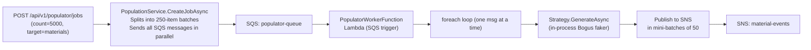

# PoC.Populator — Performance Analysis & Improvement Plan

## How the Pipeline Works Today



### Stage 1 — API (fast, already good)
- Splits the request into 250-record `PopulationJob` chunks.
- Sends all SQS messages **in parallel** with `Task.WhenAll`. ✅

### Stage 2 — Lambda Worker (slow, many issues)
- SQS delivers each batch message to a Lambda invocation.
- The Lambda can receive **multiple records per invocation** (SQS batch size setting) but the code processes them inside a **sequential `foreach` loop**. ❌
- For each message:
  - A **new strategy instance** is created via [GetStrategy()](file:///d:/Projetos/poc_feature/src/PoC.Populator/Functions/PopulatorWorkerFunction.cs#292-302). ❌ (allocations)
  - `JsonSerializerOptions` is created **inside the hot loop** in `EnsurePricesStrategy`. ❌
  - **SNS publishes** happen in mini-batches of 50 inside the loop. SNS **does not support batch publish** (like SQSs `SendMessageBatch`), so each `PublishAsync` is an individual network round-trip. ❌

---

## Identified Bottlenecks (Ranked by Impact)

### 🔴 Critical

| # | Bottleneck | Location | Why It Hurts |
|---|-----------|----------|--------------|
| 1 | **Sequential SQS message processing** | [FunctionHandler](file:///d:/Projetos/poc_feature/src/PoC.Populator/Functions/PopulatorWorkerFunction.cs#97-278) foreach | If SQS delivers 10 records in one Lambda batch, they are processed one-by-one. All concurrency gain disappears. |
| 2 | **SNS publish is one-by-one** | [FunctionHandler](file:///d:/Projetos/poc_feature/src/PoC.Populator/Functions/PopulatorWorkerFunction.cs#97-278) SNS loop | SNS has no `PublishBatch` for standard topics. Each publish = 1 HTTP round-trip to LocalStack/AWS. For 250 records, that's 250 round-trips. Use **SNS Batch** (`PublishBatchAsync`, up to 10 per call). |
| 3 | **Log level = Debug globally** | [appsettings.json](file:///d:/Projetos/poc_feature/src/PoC.Populator/appsettings.json) | Debug logging on every Lambda invocation means serialising detailed log records for thousands of messages, blowing up CloudWatch costs AND adding latency. |

### 🟠 Major

| # | Bottleneck | Location | Why It Hurts |
|---|-----------|----------|--------------|
| 4 | **New strategy instance per SQS message** | [GetStrategy()](file:///d:/Projetos/poc_feature/src/PoC.Populator/Functions/PopulatorWorkerFunction.cs#292-302) | Creates a new `Faker<>` object each time (includes locale loading, rule compilation). Strategies should be singletons/cached. |
| 5 | **`JsonSerializerOptions` created in hot path** | [EnsurePricesPopulationStrategy](file:///d:/Projetos/poc_feature/src/PoC.Populator/Domain/Services/PopulationStrategies.cs#73-114) | `new JsonSerializerOptions{...}` is slow and causes GC pressure. Should be a static readonly field. |
| 6 | **`JsonSerializerOptions` in publish loop** | [FunctionHandler](file:///d:/Projetos/poc_feature/src/PoC.Populator/Functions/PopulatorWorkerFunction.cs#97-278) SNS serialize | `JsonSerializer.Serialize(evt)` without explicit options creates default options each call. Use a cached static `JsonSerializerOptions`. |
| 7 | **`EnsurePricesStrategy` blocks on single HTTP call** | `EnsurePricesPopulationStrategy.GenerateAsync` | Fetches ALL unique components from the Materials API in a single synchronous chain. No pagination, no caching, no timeout. |
| 8 | **`BuildServiceProvider()` called at registration time** | [DependencyInjection.cs](file:///d:/Projetos/poc_feature/src/PoC.Populator/Infrastructure/DependencyInjection.cs) ln 35 | Calling `BuildServiceProvider()` inside an extension method causes a double-build and is an anti-pattern flagged by the ASP.NET Core analyzer. |

### 🟡 Minor / Optimisation

| # | Bottleneck | Location | Why It Hurts |
|---|-----------|----------|--------------|
| 9 | **SQS batch size not maximized** | Lambda trigger config | Default SQS batch size for Lambda is often low (1-10). The Lambda can handle up to **10,000 messages per batch** (with report batch failure). |
| 10 | **Fixed 250-item job batch size** | [PopulationService](file:///d:/Projetos/poc_feature/src/PoC.Populator/Infrastructure/Services/PopulationService.cs#11-61) hardcoded | Magic number, not configurable. Should be in [PopulatorOptions](file:///d:/Projetos/poc_feature/src/PoC.Populator/Infrastructure/PopulatorOptions.cs#3-11). |
| 11 | **`items.ToList()` materialisation** | [FunctionHandler](file:///d:/Projetos/poc_feature/src/PoC.Populator/Functions/PopulatorWorkerFunction.cs#97-278) ln 208 | Forces full materialisation before iteration. `IEnumerable<object>` is already generated; iterating it once is enough. |

---

## Improvement Plan

### Fix 1 — Parallel SQS Message Processing (🔴 Critical)

Replace the `foreach` loop with **parallel async processing** of all records in the batch:

```csharp
// BEFORE (sequential)
foreach (var message in ev.Records) { ... }

// AFTER (parallel, bounded concurrency)
var processingTasks = ev.Records.Select(msg => ProcessMessageAsync(msg));
await Task.WhenAll(processingTasks);
```

Extract the inner logic into a `ProcessMessageAsync(SQSEvent.SQSMessage message)` private method. This means all messages in a Lambda batch execute **concurrently**.

> [!IMPORTANT]
> Also implement **SQS Partial Batch Failure** (`SqsBatchResponse`) so individual message failures don't poison the whole batch.

---

### Fix 2 — Use SNS `PublishBatchAsync` (🔴 Critical)

SNS **does** support `PublishBatchAsync` (up to 10 entries per call, 256KB total). Replace the individual publish loop:

```csharp
// BEFORE: 250 individual publishes = 250 round-trips
tasks.Add(_snsClient.PublishAsync(publishRequest));

// AFTER: ceil(250/10) = 25 batch publishes = 25 round-trips
// Group items into chunks of 10 and call PublishBatchAsync
var chunks = itemPublishRequests.Chunk(10);
var batchTasks = chunks.Select(chunk => _snsClient.PublishBatchAsync(new PublishBatchRequest
{
    TopicArn = _topicArn,
    PublishBatchRequestEntries = chunk.Select((req, i) => new PublishBatchRequestEntry
    {
        Id = i.ToString(),
        Message = req.Message,
        MessageAttributes = req.MessageAttributes
    }).ToList()
}));
await Task.WhenAll(batchTasks);
```

**Expected reduction**: 250 round-trips → 25 round-trips per 250-item batch = **10x fewer network calls**.

---

### Fix 3 — Set Log Level to Information in Production (🔴 Critical)

```json
// appsettings.json
"Logging": {
  "LogLevel": {
    "Default": "Information",
    "Microsoft.AspNetCore": "Warning"
  }
}
```

Debug logging serialises every SQS body and every inner operation. In a high-throughput Lambda, this adds significant CPU time and log egress cost.

---

### Fix 4 — Cache Strategies as Singletons (🟠 Major)

Add strategies to DI as singletons keyed by target name instead of using `new` inside [GetStrategy()](file:///d:/Projetos/poc_feature/src/PoC.Populator/Functions/PopulatorWorkerFunction.cs#292-302):

```csharp
// In DependencyInjection.cs
services.AddSingleton<MaterialPopulationStrategy>();
services.AddSingleton<PricePopulationStrategy>();
services.AddSingleton<EnsurePricesPopulationStrategy>();

// Inject IEnumerable<IPopulationStrategy> in the function and resolve by TargetTable/name
```

This avoids re-initialising `Faker<>` (which loads locale data and compiles rules) on every single message.

---

### Fix 5 — Cache `JsonSerializerOptions` as static (🟠 Major)

```csharp
// In PopulatorWorkerFunction or a shared location
private static readonly JsonSerializerOptions _jsonOptions = new()
{
    PropertyNameCaseInsensitive = true,
    PropertyNamingPolicy = JsonNamingPolicy.SnakeCaseLower
};

// In EnsurePricesPopulationStrategy
private static readonly JsonSerializerOptions _snakeCaseOptions = new()
{
    PropertyNamingPolicy = JsonNamingPolicy.SnakeCaseLower
};
```

---

### Fix 6 — Increase SQS Lambda Batch Size + Enable Batch Failure Reporting (🟡 Minor)

In the AWS/LocalStack provisioning scripts, set:
- **`BatchSize`**: up to 10,000 (Lambda SQS trigger)
- **`FunctionResponseTypes`**: `["ReportBatchItemFailures"]`
- **`MaximumBatchingWindowInSeconds`**: 5–30 seconds to aggregate more messages before invoking Lambda (reduces cold starts, improves efficiency)

---

### Fix 7 — Move Batch Size to Configuration (🟡 Minor)

```csharp
// PopulatorOptions.cs
public int JobBatchSize { get; set; } = 250;

// PopulationService.cs
int batchSize = options.Value.JobBatchSize;
```

---

## Expected Throughput Impact Summary

| Improvement | Estimated Gain |
|------------|---------------|
| Parallel SQS message processing | **5-10x** (depends on Lambda batch size) |
| SNS batch publish (10 per call) | **10x fewer round-trips** |
| Disable Debug logging | **15-25% CPU reduction** |
| Cached strategies (no Faker re-init) | **~5-10% per invocation** |
| Cached JsonSerializerOptions | **~2-5% CPU reduction** |
| Larger SQS batch window | **Fewer cold starts, higher sustained throughput** |

> [!TIP]
> The **single biggest win** is Fixes 1 + 2 combined: processing all SQS records in a Lambda batch concurrently **and** using SNS batch publish. Together they can increase throughput by **an order of magnitude** without infrastructure changes.
