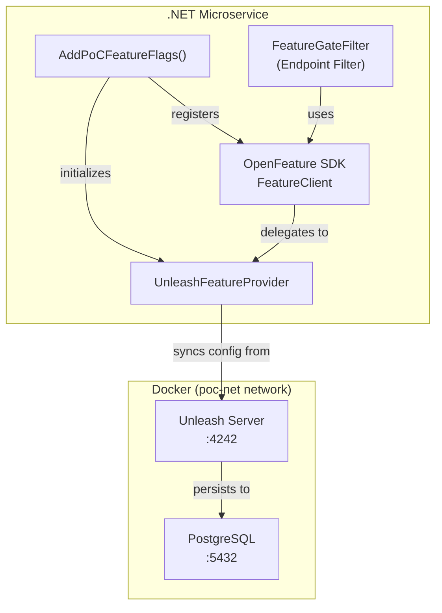

# Feature Flags Guide

The PoC project implements a **vendor-agnostic Feature Flags system** using the [OpenFeature](https://openfeature.dev/) standard with [Unleash](https://www.getunleash.io/) as the backend provider. This enables toggling endpoint availability via configuration — **without redeploy**.

---

## 🏗️ Architecture Overview

### Why OpenFeature?

OpenFeature is a **CNCF** project that provides a vendor-agnostic API for feature flagging. It allows us to swap providers (e.g., Unleash to LaunchDarkly) without changing application code.

### Component Map



### Accessing the Dashboard

*   **URL:** [http://localhost:4242](http://localhost:4242)
*   **User:** `admin` (or `admin2`)
*   **Password:** `password`

---

## 🔧 Implementation Details

### Library Structure
Feature flagging logic is centralized in the **`PoC.FeatureFlags`** library.

*   **Namespace:** `PoC.FeatureFlags`
*   **Provider:** `PoC.FeatureFlags.Extensions.UnleashFeatureProvider`
*   **Extensions:** `PoC.FeatureFlags.Extensions.FeatureGateExtensions`

### Declarative Usage (`.WithFeatureGate()`)

We use Minimal API Endpoint Filters to secure endpoints declaratively.

```csharp
// MaterialsEndpoints.cs
group.MapPost("/", CreateMaterial)
     .WithName("CreateMaterial")
     .WithFeatureGate("materials-create"); // ← Blocks request if flag is disabled
```

### How it Works
1.  The `.WithFeatureGate("key")` extension adds an **Endpoint Filter**.
2.  The filter resolves `IFeatureClient` (OpenFeature SDK) from DI.
3.  It evaluates the flag asynchronously (`GetBooleanValueAsync`).
4.  If `false`: Returns `404 Not Found` (hiding the feature).
5.  If `true`: Executes the endpoint handler.

### Imperative Usage (Manual Check)

For logic *inside* a service:

```csharp
public class MyService(IFeatureClient featureClient)
{
    public async Task DoWork()
    {
        if (await featureClient.GetBooleanValueAsync("my-flag", false))
        {
            // Do new behavior
        }
    }
}
```

## 7. Troubleshooting

*   **Flag not updating?** Check `FetchTogglesIntervalSeconds` (default 15-30s).
*   **Connection Refused?** Ensure `unleash` container is running.
*   **"Feature Disabled" log?** This is expected behavior when a gate blocks a request.
