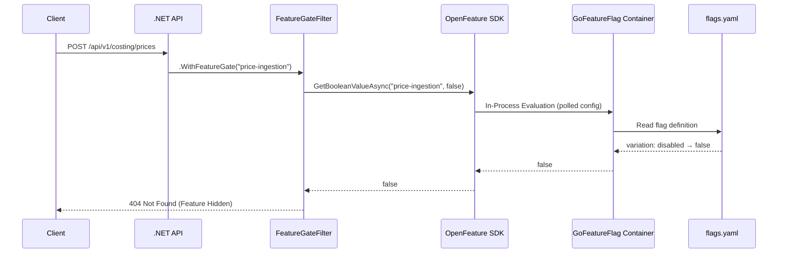
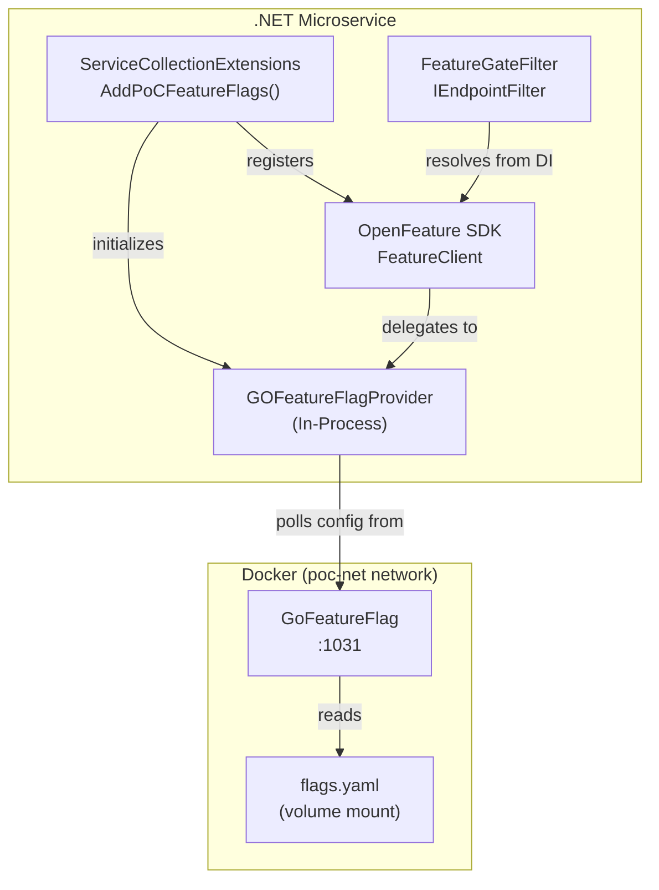

# Feature Flags Guide

The PoC project implements a **vendor-agnostic Feature Flags system** using the [OpenFeature](https://openfeature.dev/) standard with [GO Feature Flag](https://gofeatureflag.org/) as the backend provider. This enables toggling endpoint availability via configuration — **without redeploy**.

---

## 🏗️ Architecture Overview

### Why OpenFeature?

OpenFeature is a **CNCF (Cloud Native Computing Foundation)** project that provides a vendor-agnostic, community-driven API for feature flagging. By coding against the OpenFeature SDK rather than a vendor-specific API, we can swap providers (LaunchDarkly, Flagsmith, Split, etc.) without changing application code.

### Why GO Feature Flag?

GO Feature Flag is a lightweight, self-hosted feature flag server that:
- Runs as a **single Docker container** (no external dependencies).
- Reads flag definitions from a **YAML file** (GitOps-friendly).
- Supports **hot-reload** — editing `flags.yaml` updates flags immediately, no restart required.
- Provides a **Swagger UI** for API inspection at the relay proxy port.

### Request Flow



### Component Map



---

## 🔧 Implementation Details

### Declarative Approach (Primary) — `.WithFeatureGate()`

The primary method follows an **Aspect-Oriented Programming (AOP)** pattern. Feature gate logic is completely separated from business logic using an `IEndpointFilter`:

```csharp
// CostingEndpoints.cs — Business logic stays clean
group.MapPost("/prices", UpsertPriceAsync)
     .WithName("UpsertPrice")
     .WithFeatureGate("price-ingestion");    // ← One line, zero pollution

group.MapPost("/estimations", CalculateCostAsync)
     .WithName("CalculateCost")
     .WithFeatureGate("price-calculation");  // ← Same pattern
```

> **Note:** This project uses **Minimal APIs**, not MVC Controllers. The `.WithFeatureGate()` extension method is the Minimal API equivalent of an `[ActionFilter]` attribute. It attaches a `FeatureGateFilter` (`IEndpointFilter`) to the endpoint pipeline.

**Key files:**
- `PoC.Shared.Infrastructure/Filters/FeatureGateFilter.cs` — The filter logic.
- `PoC.Shared.Infrastructure/Extensions/FeatureGateExtensions.cs` — The `.WithFeatureGate()` extension.

### Imperative Approach (Advanced) — Direct SDK Usage

For complex scenarios where a flag controls logic *inside* a service (not an entire endpoint), inject `FeatureClient` directly:

```csharp
public class SomeService
{
    private readonly FeatureClient _featureClient;

    public SomeService(FeatureClient featureClient)
    {
        _featureClient = featureClient;
    }

    public async Task DoWorkAsync()
    {
        var context = EvaluationContext.Builder()
            .SetTargetingKey("user-123")
            .Set("email", "user@example.com")
            .Build();

        var useNewAlgorithm = await _featureClient.GetBooleanValueAsync(
            "new-algorithm-enabled", false, context);

        if (useNewAlgorithm)
        {
            // New path
        }
        else
        {
            // Legacy path
        }
    }
}
```

> **Rule:** Prefer the declarative `.WithFeatureGate()` approach. Use the imperative approach **only** when the flag controls internal branching logic, not endpoint availability.

### Hot-Reload

GO Feature Flag periodically polls the flag configuration. When you edit `docker/feature-flags/flags.yaml`, changes take effect **automatically** within the polling interval (default: 120 seconds, configurable via `FlagChangePollingIntervalMs`).

No application restart, no redeploy.

### Multi-Environment Strategy

Yes, feature flags can (and should) be controlled per environment (Dev, Stage, Prod). Since GoFeatureFlag reads from a file, the strategy is to **mount a different configuration file** depending on the environment.

**Recommended Structure:**
```text
/docker
  /feature-flags
    /environments
      flags.dev.yaml   # Enabled: true, Rule: beta-users
      flags.prod.yaml  # Enabled: false (safe default)
```

**Docker Compose Configuration:**
Use an environment variable to select the file:

```yaml
services:
  gofeatureflag:
    volumes:
      - ./environments/flags.${ASPNETCORE_ENVIRONMENT}.yaml:/config/flags.yaml
```

**Kubernetes Configuration:**
In K8s, use a **ConfigMap**.
1. Create a ConfigMap from the environment-specific YAML.
2. Mount it as a volume to `/config/flags.yaml` in the GoFeatureFlag pod.

---

## ⚡ Key Considerations & Best Practices

### Granularity

> **Warning:** Do not create a flag for every `if/else` in your code.

Flags should gate **features** (a user-facing capability), not implementation details. Good examples:
- ✅ `price-calculation` — Gates an entire pricing endpoint.
- ✅ `new-dashboard` — Gates a new UI feature.
- ❌ `use-cache-for-query-x` — Too granular, use config instead.

### Lifecycle & Technical Debt

Feature flags are **temporary by design**.

```
┌──────────┐    ┌─────────┐    ┌──────────┐    ┌─────────────┐
│ Created  │───►│ Testing │───►│  Stable  │───►│   Removed   │
│ (false)  │    │ (true)  │    │ (true)   │    │  (cleanup)  │
└──────────┘    └─────────┘    └──────────┘    └─────────────┘
```

**Rules:**
1. Every flag **MUST** have an owner and a planned removal date.
2. Once a feature is stable in production (typically 1-2 sprints after full rollout), the flag and `.WithFeatureGate()` call **MUST** be removed.
3. Leftover flags are **technical debt**. Treat them with the same urgency as deprecated code.

### Default Values & Resilience

The `FeatureGateFilter` is designed to be **fail-safe**:

| Scenario | Behavior |
|---|---|
| Flag evaluates to `true` | Request proceeds normally |
| Flag evaluates to `false` | Returns **404 Not Found** (feature hidden) |
| GoFeatureFlag container is down | Returns **404 Not Found** (feature hidden) |
| Network error / timeout | Returns **404 Not Found** (feature hidden) |

The fail-safe default is `false` (disabled). This means if the flag infrastructure is unavailable, gated features are hidden rather than accidentally exposed.

### Offline Behavior

The system is designed to be **resilient to infrastructure failures**.

#### 1. Startup Failure (Offline at Boot)
If the GoFeatureFlag container is unreachable when the .NET application starts:
- The `SetProviderAsync` call may log an error but does **NOT** crash the application (provider initialization is often non-blocking or resilient).
- The OpenFeature SDK initializes with a "No-Op" or "Not Ready" state.
- **Consequence:** All flag evaluations return the **SDK default value** (which is `false` in our `FeatureGateFilter`).
- **Result:** Usage of gated endpoints will return `404 Not Found`. The app remains healthy, but features are safe-guarded.

#### 2. Runtime Failure (Offline after Boot)
If the connection drops while the app is running:
- The GoFeatureFlag provider (running in-process) typically caches the last known flags.
- It attempts to polling/reconnect in the background.
- If the cache prevents evaluation or an error occurs during `GetBooleanValueAsync`:
  - The `FeatureGateFilter` wraps the call in a `try/catch` block.
  - It catches the exception, logs a warning (`Failed to evaluate...`), and defaults to `false`.
- **Result:** Users get `404 Not Found` for the specific endpoint. The rest of the API continues to function normally.

---

## 📖 How-To Guide (Developer Manual)

### Step 1: Define the Flag

Edit `docker/feature-flags/flags.yaml`.

**Simple Boolean Flag:**

```yaml
my-new-feature:
  variations:
    enabled: true
    disabled: false
  defaultRule:
    variation: disabled   # Feature starts OFF
```

**Percentage Rollout:**

```yaml
gradual-rollout:
  variations:
    enabled: true
    disabled: false
  defaultRule:
    percentage:
      enabled: 20         # 20% of users get the feature
      disabled: 80
```

**Rule-Based (Targeting Specific Users):**

```yaml
beta-feature:
  variations:
    enabled: true
    disabled: false
  targeting:
    - name: beta-users
      query: targetingKey eq "beta-tester"
      variation: enabled
  defaultRule:
    variation: disabled   # Everyone else gets disabled
```

### Step 2: Gate the Endpoint

In your endpoint registration, chain `.WithFeatureGate()`:

```csharp
// 1. Add using
using PoC.Shared.Infrastructure.Extensions;

// 2. Apply to endpoint
group.MapPost("/my-endpoint", MyHandlerAsync)
     .WithName("MyEndpoint")
     .WithFeatureGate("my-new-feature");
```

### Step 3: Register Feature Flags in `Program.cs`

Ensure `AddPoCFeatureFlags` is called during startup (already done for `PoC.Costing`):

```csharp
// Feature Flags (OpenFeature + GO Feature Flag)
builder.Services.AddPoCFeatureFlags(builder.Configuration);
```

### Step 4: Configure the Endpoint

Add to `appsettings.json` (or `appsettings.Development.json` for local dev):

```json
{
  "FeatureFlags": {
    "Endpoint": "http://localhost:1031",
    "AppName": "poc-app"
  }
}
```

> **Docker environments:** Use the service name `http://gofeatureflag:1031` instead of `localhost`.

### Step 5: Start the GoFeatureFlag Container

```bash
# Ensure the shared network exists
docker network create poc-net || true

# Start GoFeatureFlag
docker compose -f docker/feature-flags/docker-compose.yaml up -d
```

### Step 6: Verify

- **Swagger UI:** Open `http://localhost:1031/swagger/` to inspect the GoFeatureFlag API.
- **Test the endpoint:** Call the gated endpoint and verify it returns `404` (disabled) or `200` (enabled).
- **Toggle:** Edit `flags.yaml`, change `variation: disabled` to `variation: enabled`, wait ~2 minutes, and verify the endpoint becomes available.

---

## 🐛 Troubleshooting

### Endpoint returns 404 unexpectedly

| Check | Command |
|---|---|
| Is the container running? | `docker ps \| grep gofeatureflag` |
| Is the container healthy? | `curl http://localhost:1031/health` |
| Is the flag defined? | Check `docker/feature-flags/flags.yaml` |
| Is the flag enabled? | Verify `defaultRule.variation` is `enabled` |

### Endpoint returns 404 even with flag enabled

- **Check logs** for `Feature '{FlagKey}' is disabled`:
  ```bash
  # In the .NET app logs (structured JSON), look for:
  # {"FlagKey": "my-flag", ...}
  ```
- **Check targeting key**: The filter uses `anonymous` as the targeting key. If your flag has targeting rules, ensure they match.

### GoFeatureFlag container won't start

```bash
# Check container logs
docker logs gofeatureflag

# Common issues:
# - flags.yaml syntax error → Fix YAML indentation
# - Port 1031 already in use → Stop conflicting process
# - poc-net network not found → Run: docker network create poc-net
```

### Debug flag evaluation

Enable verbose logging in `appsettings.Development.json`:

```json
{
  "Serilog": {
    "MinimumLevel": {
      "Override": {
        "PoC.Shared.Infrastructure.Filters": "Debug"
      }
    }
  }
}
```

This will output detailed logs from `FeatureGateFilter` for every flag evaluation.

---

## 📋 Current Flags

| Flag Key | Default | Controls | Owner |
|---|---|---|---|
| `price-calculation` | `enabled` | `POST /api/v1/costing/estimations` | Team |
| `price-ingestion` | `disabled` | `POST /api/v1/costing/prices` | Team |

---

## 🔗 References

- [OpenFeature Specification](https://openfeature.dev/specification)
- [GO Feature Flag Docs](https://gofeatureflag.org/docs)
- [GO Feature Flag .NET Provider](https://gofeatureflag.org/docs/sdk/server_providers/openfeature_dotnet)
- [Flag Format Reference](https://gofeatureflag.org/docs/configure_flag/flag_format)
