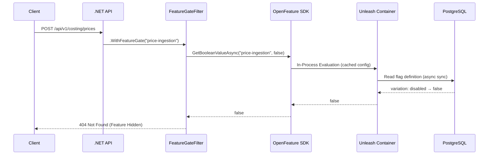
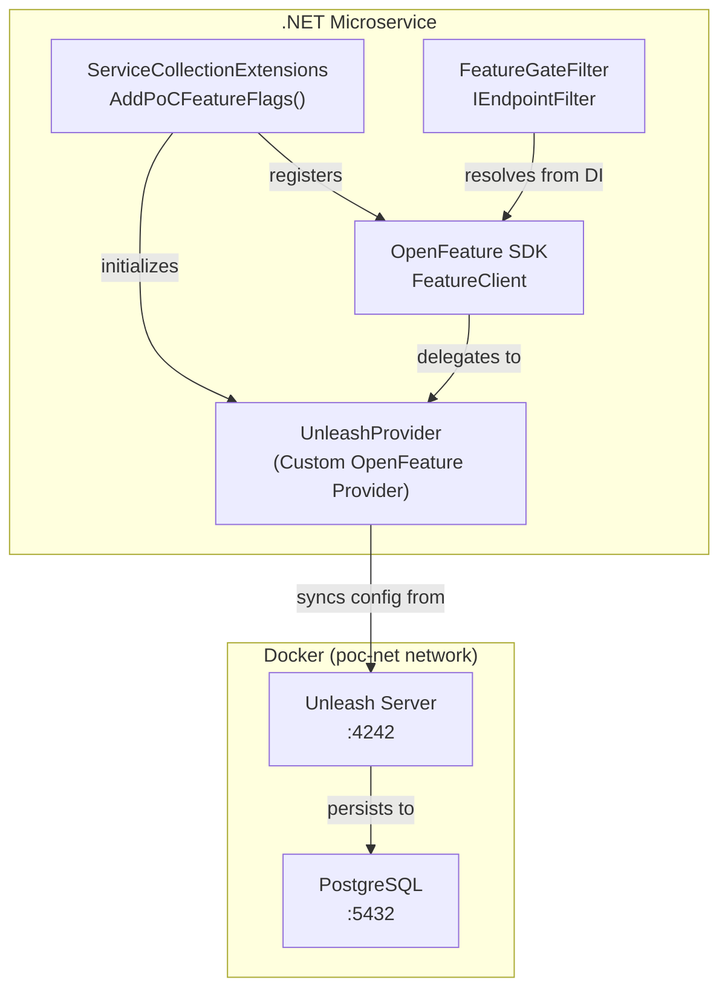

# Feature Flags Guide

The PoC project implements a **vendor-agnostic Feature Flags system** using the [OpenFeature](https://openfeature.dev/) standard with [Unleash](https://www.getunleash.io/) as the backend provider. This enables toggling endpoint availability via configuration — **without redeploy**.

---

## 🏗️ Architecture Overview

### Why OpenFeature?

OpenFeature is a **CNCF (Cloud Native Computing Foundation)** project that provides a vendor-agnostic, community-driven API for feature flagging. By coding against the OpenFeature SDK rather than a vendor-specific API, we can swap providers (LaunchDarkly, Flagsmith, Split, etc.) without changing application code.

### Why Unleash?

Unleash is a powerful, enterprise-ready feature management solution that:
- Runs as a **Docker container** (with PostgreSQL backend).
- Provides a **rich UI** for managing feature toggles, strategies, and user segments.
- Supports **Gradual Rollouts**, **User Targeting**, and **A/B Testing**.
- Has a robust **.NET SDK** (`Unleash.Client`) which we wrap with OpenFeature.

### Accessing the Dashboard

The Unleash dashboard is available at **[http://localhost:4242](http://localhost:4242)**.

**Credentials:**
- **User:** `admin2` (or `admin`)
- **Password:** `password`

> **Note:** The project includes an initialization script (`scripts/init-unleash.ps1`) that automatically configures the default strategies and creates necessary flags on startup. If you cannot login with `admin`, try `admin2` which is created as a backup administrator.

### Request Flow



### Component Map



---

## 🔧 Implementation Details

### Declarative Approach (Primary) — `.WithFeatureGate()`

The primary method follows an **Aspect-Oriented Programming (AOP)** pattern. Feature gate logic is completely separated from business logic using an `IEndpointFilter`:

```csharp
// CostingEndpoints.cs — Business logic stays clean
group.MapPost("/prices", UpsertPriceAsync)
     .WithName("UpsertPrice")
     .WithFeatureGate("price-ingestion");    // ← One line, zero pollution

group.MapPost("/estimations", CalculateCostAsync)
     .WithName("CalculateCost")
     .WithFeatureGate("price-calculation");  // ← Same pattern
```

> **Note:** This project uses **Minimal APIs**, not MVC Controllers. The `.WithFeatureGate()` extension method is the Minimal API equivalent of an `[ActionFilter]` attribute. It attaches a `FeatureGateFilter` (`IEndpointFilter`) to the endpoint pipeline.

**Key files:**
- `PoC.Shared.Infrastructure/Filters/FeatureGateFilter.cs` — The filter logic.
- `PoC.Shared.Infrastructure/Extensions/FeatureGateExtensions.cs` — The `.WithFeatureGate()` extension.
- `PoC.Shared.Infrastructure/FeatureFlag/UnleashProvider.cs` — The custom OpenFeature provider for Unleash.

### Imperative Approach (Advanced) — Direct SDK Usage

For complex scenarios where a flag controls logic *inside* a service (not an entire endpoint), inject `FeatureClient` directly:

```csharp
public class SomeService
{
    private readonly FeatureClient _featureClient;

    public SomeService(FeatureClient featureClient)
    {
        _featureClient = featureClient;
    }

    public async Task DoSomething()
    {
        if (await _featureClient.GetBooleanValueAsync("new-algo", false))
        {
            // Use new algorithm
        }
    }
}
```

## 🚀 Initialization

The `init-unleash.sh` script (run automatically via Docker Compose) initializes the Unleash instance with default flags and strategies, ensuring a ready-to-use environment for development.
