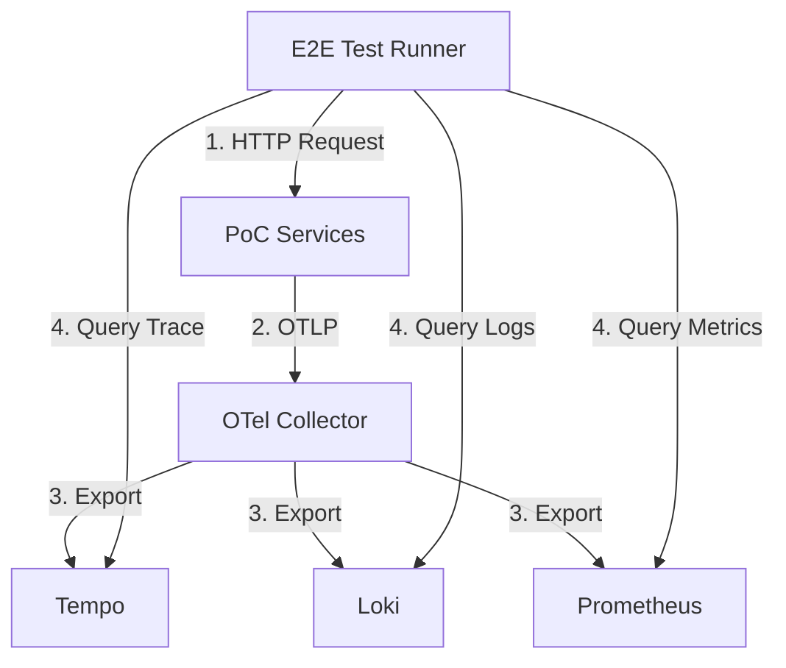

# 05 - Automated Observability Testing Strategy (E2E)

This document details the strategy for validating the entire observability pipeline (Application -> Collector -> Backends) using automated E2E tests running in Docker.

## Goal
Ensure that for every action in the system:
1.  **Traces** are generated, propagated, and stored in Tempo.
2.  **Logs** are structured, correlated with Traces, and stored in Loki.
3.  **Metrics** are aggregated and exposed to Prometheus/Mimir.

## Test Architecture

The tests will run as a separate container (e.g., `PoC.Observability.E2E`) within the `observability_net` network.



## Test Scenarios

### 1. Middleware & Correlation Verification
**Objective**: Ensure every request has a TraceId and it propagates to logs.

*   **Action**: Send HTTP GET to `/health`.
*   **Assertions**:
    1.  Response header `trace-id` is present.
    2.  **Loki Query**: `{job=~".+"} |= "$traceId"` returns at least 1 log line.
        *   *Note:* The OTel Collector maps `service.name` to the `job` label by default.
    3.  **Tempo Query**: `/api/traces/$traceId` returns a trace with:
        *   Root span (ASP.NET Core)
        *   Status code 200.
        *   *Note:* Tempo may return the TraceID in Base64 format. Tests must handle both Hex and Base64 representations.

### 2. Error Handling & Exception Logging
**Objective**: Ensure exceptions are logged with stack traces and marked as errors in traces.

*   **Action**: Send HTTP POST to an endpoint designed to fail (or trigger 500).
*   **Assertions**:
    1.  Response status is 500.
    2.  **Tempo Query**: Trace exists and Root Span `status.code` = `Error`.
    3.  **Loki Query**: `{job=~".+"} |= "$traceId"` (or broad search) returns logs.

### 3. Business Telemetry (Cost Calculation)
**Objective**: Ensure custom business metrics and critical path traces are accurate.

*   **Action**: POST `/api/v1/costing/estimations` (Trigger Calculation).
*   **Assertions**:
    1.  **Prometheus Query**: `increase(costing_calculations_total[1m])` > 0.
    2.  **Tempo Query**: Trace contains:
        *   `http.server` span (API)
        *   `aws.dynamodb` span (Price Lookup) - *Requires AWS SDK Instrumentation*
        *   `costing.calculation` span (Domain Logic)

### 4. Dependency Tracking (DynamoDB/SQS)
**Objective**: Verify that calls to AWS services are instrumented.

*   **Action**: Trigger a flow that writes to DynamoDB.
*   **Assertions**:
    1.  **Tempo Query**: Trace contains span with `db.system="dynamodb"` and `aws.table_name="..."`.

## Implementation Details

### Test Stack
*   **Framework**: xUnit + FluentAssertions
*   **HTTP Client**: `RestSharp` or `HttpClient`
*   **Resilience**: Polly (to retry queries against Tempo/Loki as ingestion is asynchronous).

### Polling / Eventual Consistency
Observability backends are **eventually consistent**. Tests must use a "Retry until Success or Timeout" pattern.
*   *Timeout*: 15 seconds.
*   *Interval*: 1 second.

### Sample Test Code (Conceptual)

```csharp
[Fact]
public async Task Request_Should_Generate_Trace_And_Logs()
{
    // 1. Act
    var response = await _apiClient.GetAsync("/health");
    var traceId = response.Headers.GetValues("trace-id").FirstOrDefault();
    
    // 2. Assert Response
    traceId.Should().NotBeNull();
    
    // 3. Assert Trace (Tempo)
    await _retryPolicy.ExecuteAsync(async () => 
    {
        var trace = await _tempoClient.GetTraceAsync(traceId);
        trace.Spans.Should().Contain(s => s.Name == "GET /health");
    });

    // 4. Assert Logs (Loki)
    await _retryPolicy.ExecuteAsync(async () => 
    {
        var logs = await _lokiClient.QueryAsync($"{{service_name=\"PoC-Costing\"}} |= \"{traceId}\"");
        logs.Streams.Should().NotBeEmpty();
    });
}
```

## Pipeline Integration
These tests should run **after** the `docker-compose up` step in CI/CD pipeline and block deployment if observability is broken.
